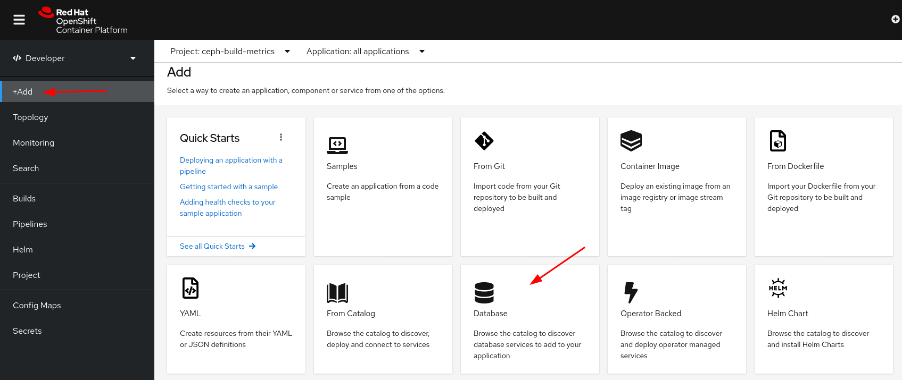
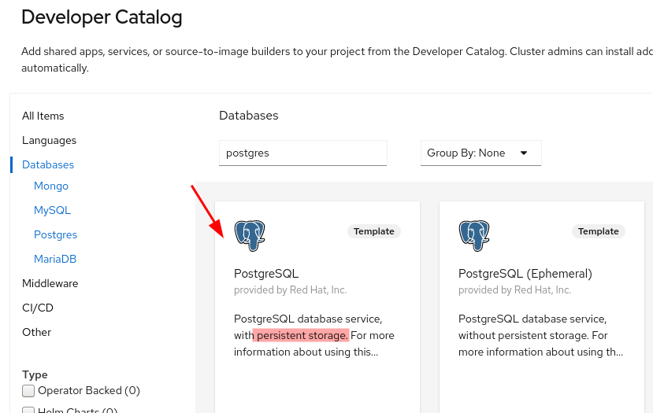
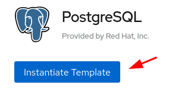
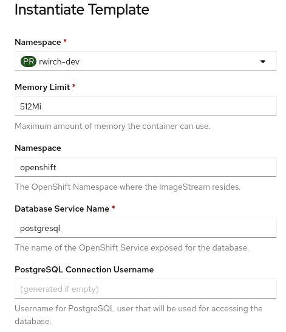
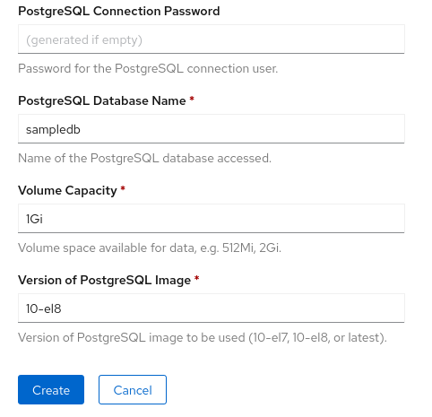
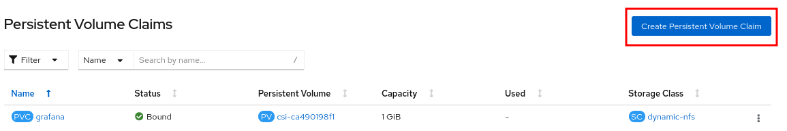
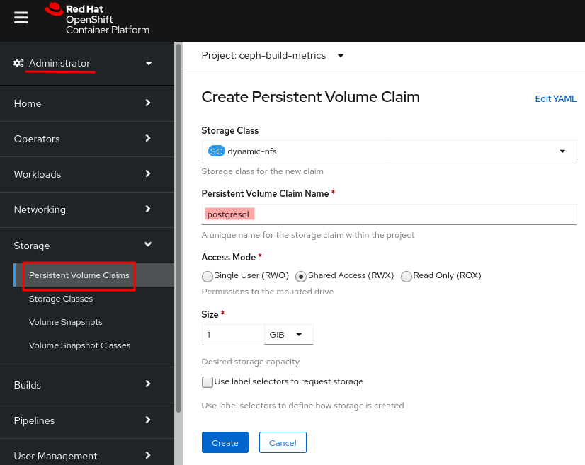

# How to build a postgres database in OCP4

Rory Wirch, July 2021
Red Hat
Ceph Build Team: Brew Build Times Project

## Outline:
1. Introduction and justification
2. Setting up a postgres container and PVC in OCP4
3. How to interact with the database using port forwarding and pgadmin4
4. How to populate the database
5. Glossary

## Introduction and Justification

The visualization for the brew build time analysis project has been done using Grafana on an OCP4 instance. One of our experiments with the project involved studying whether lines of code for the Ceph project impacted brew build times. To study this,a tool was used to collect data on the lines of code in each Ceph version. This produced a csv file that included Ceph version numbers, git hashes, and a break down of the lines of code. 

This data needed to be included in grafana as a datasource in order to be used for visualization. The problem was that grafana does not support using csv files as datasources. There is a plugin that allows for csv's to be used as datasources, however after some testing it was determined that the plugin would not be useful without a lot of time tinkering with it and the grafana container.

The next approach to getting the data into grafana was to build a small database in OCP4 to be used as a datasource in grafana. This writeup will cover all steps in building and populating a postgres database in OCP4.

## Setting up the container and PVC

For this step, you will need access to an OpenShift project. For this write up, I will be using OCP4. I will include screenshots of the web interface for all steps.

**Adding a Postgres Container**
To add a postgres container using the web interface, navigate to the add tab and then select database from the options.

This will take you to the developer catalog, which contains a list of database applications. From this list select PostgreSQL. Make sure that it has persistent storage. 

After selecting PostgreSQL, select the instantiate template button.

This leads to a form with details about how the database will be configured. 

 
Fill out the fields depending on your needs. Note that the username and password will be automatically generated if left empty. 

The username and password can be found later on in the secrets tab in OCP4.

Once finished, click the create button at the end of the form.

**Adding a Persistent Volume Claim**

For the postgres container to run it will also require a persistent volume claim (PVC). This will allocate storage space for our PostgreSQL container to use.

To add a PVC in OpenShift, navigate to the Administrator section, then open the Storage tab and click the "Create Persistent Volume Claim" button in the top right corner of the page.

You will be brought to a page where you can configure your PVC. 
- Make sure that the name is "postgresql" so that the container can find and then mount the PVC. 
- Depending on the storage class that you choose, you can select a shared access mode which will allow multiple clients to have access to the PVC. This mode is selected here because we want to be able to write to the PVC and we want Grafana to be able to read from the database.
- The "Size" is the amount of storage being allocated. This should match the amount allocated when we configured the database under "Volume Capacity". 

## Glossary

Definitions of all those pesky technical terms

PVC: Persistant volume claim

OCP4: Openshift Container Platform 4

Namespace: