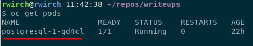

# How to build a PostgreSQL database in OCP4

Rory Wirch, July 2021 \
Red Hat \
Ceph Build Team: Brew Build Times Project

## Outline:
1. Introduction and justification
2. Setting up a PostgreSQL pod and PVC in OCP4
3. How to connect the database to pgAdmin 4
4. How to populate the database with csv files
5. Glossary

## 1. Introduction and Justification

The visualization for the brew build time analysis project has been done using Grafana on an OCP4 instance. One of our experiments with the project involved studying whether lines of code for the Ceph project impacted brew build times. To study this,a tool was used to collect data on the lines of code in each Ceph version. This produced a csv file that included Ceph version numbers, git hashes, and a break down of the lines of code. 

This data needed to be included in grafana as a datasource in order to be used for visualization. The problem was that grafana does not support using csv files as datasources. There is a plugin that allows for csv's to be used as datasources, however after some testing it was determined that the plugin would not be useful without a lot of time tinkering with it and the grafana pod.

The next approach to getting the data into grafana was to build a small database in OCP4 to be used as a datasource in grafana. This writeup will cover all steps in building and populating a PostgreSQL database in OCP4.

## 2. Setting up a PostgreSQL pod and PVC in OCP4

For this step, you will need access to an OpenShift project. For this write up, I will be using OCP4. I will include screenshots of the web interface for all steps.

**Adding a PostgreSQL pod**

To add a PostgreSQL pod using the web interface, navigate to the add tab and then select database from the options.


This will take you to the developer catalog, which contains a list of database applications. From this list select PostgreSQL. Make sure that it has persistent storage. 


After selecting PostgreSQL, select the instantiate template button.


This leads to a form with details about how the database will be configured. 

- Fill out the fields depending on your needs. Note that the username and password will be automatically generated if left empty. 

- The username and password can be found later on in the secrets tab in OCP4.

- Once finished, click the create button at the end of the form.

 


**Adding a Persistent Volume Claim**

For the PostgreSQL pod to run it will also require a persistent volume claim (PVC). This will allocate storage space for our PostgreSQL pod to use.

To add a PVC in OpenShift, navigate to the Administrator section, then open the Storage tab and click the "Create Persistent Volume Claim" button in the top right corner of the page.


You will be brought to a page where you can configure your PVC. 
- Make sure that the name is "PostgreSQL" so that the pod can find and then mount the PVC. 
- Depending on the storage class that you choose, you can select a shared access mode which will allow multiple clients to have access to the PVC. This mode is selected here because we want to be able to write to the PVC and we want Grafana to be able to read from the database.
- The "Size" is the amount of storage being allocated. This should match the amount allocated when we configured the database under "Volume Capacity". 
- Once finished click the create button. The PVC will be created and your PostgreSQL pod should be able to run.


**Check that the pod is running**

In the OpenShift web interface switch to the developer perspective, then navigate to the topology tab. There should be a bubble labeled "PostgreSQL". Click the bubble and then navigate to the "Resources" panel on the right. There you should see that it is running.


## 3. How to connect the database to pgAdmin 4

By this point we have PostgreSQL running in OCP4. What we need to do now is populate it with data. To do this we will use port forwarding and pgAdmin 4.

Go to the [pgAdmin 4 website](https://www.pgadmin.org/) and download and install a version that will work on your machine.

To access the database with pgAdmin we need to create a temporary connection to it using port forwarding. We will be using a terminal and the OpenShift CLI. 

**Port forwarding**

In order to use port forwarding, we need to be connected to the OpenShift cluster by using the ```oc login``` command. We will also need to have the pod name of our PostgreSQL pod.

Run the command ```oc get pods```, the output should look similar to this:



The underlined output is the name of my PostgreSQL pod. Yours will look similar to this, but will not be an exact match.

The command we will run to do our port forwarding has the following format:

```oc port-forward <pod-name> <local-port>:<remote-port>```

The PostgreSQL database will be running on port 5432. I will be exposing it to my local port 15432, however you can use any open port on your local machine. The command I'll run on my machine will be:

```oc port-forward postgresql-1-qd4cl 15432:5432```

The output should look something like this:


The terminal that you run the port forwarding command in will need to remain active for as long as you need this connection. Once we're finished with the tutorial we can close this terminal or terminate it by using ```ctrl-c``` in the terminal.

At this point we can access our PostgreSQL database through ```127.0.0.1:15432```

**Adding a server in pgAdmin 4**

To add a server to pgAdmin, click the Object tab > Create > Server...


This will bring a pop up where you can configure the connection to the PostgreSQL server. The host name/ address will be ```127.0.0.1``` and the port will be ```15432``` or the local port you chose earlier.  


The username and password that I have were automatically generated when setting up PostgreSQL. They can be found on OpenShift under the "Secrets" tab. Search for "postgresql", the username, password, and database name can be found there.


Once you have added the username and password, click save and your database should now be connected to pgAdmin!


I added my database with the name ```ocp-postgresql```, which can be seen in the above picture. The database name is sampledb, this is where we will add tables and add data from csv files.

## 4. How to populate the database with csv files

At this point we have built a PostgreSQL database in OpenShift and connected it to pgAdmin 4. Now we need to add tables and add some test data from csv files. These files can be found in the test-data folder in this directory.

**Creating a table in pgAdmin**

To add a table to PostgreSQL using pgAdmin, click databases > sampledb > schemas > public then right click on the "Table", then click "Create" and then click on "Table". This will open a window to configure your new table.


The create table window will have a "General" tab where a table name can be added. The first table created is named "loc_data".


In the same window there is a "Columns" tab, this is where we will add columns for the table. The table "loc_data" will have the following names and data types
- loc_version : text
- cpp : integer
- c_cpp_header : integer
- python : integer


Once the columns are added, save the table by clicking the save button on the bottom right of the window.

Repeat this process to create another table named "build_info" with the following columns and data types.
- ceph_version : text
- completion_time : timestamp without timezone
- creation_time : timestamp without timezone

Once you've done this, your tables tab should look like this. The table names and column names have been highlighted.


**Populating the database with csv files**

There are two test files that we are going to use to populate our database: "build-times-test-data.csv" and "loc-test-data.csv". These files can be found in the "test-data" folder in this repository.

We will populate the "build_info" table with data from the "build-times-test-data.csv" file first.

Right click the table name, and click "Import/Export..." as shown below


After clicking "Import/Export..." a window will apear. 
- Toggle the "Import/Export" button at the top of the window so we can import a file. 
- Add the file path to the "build-times-test-data.csv" file.
- Toggle the header button to "Yes".
- Select "," as the delimiter.


Switch to the "Columns" tab at the top of the window. 


Make sure that the columns that are being imported match the column names that are used in the table.

Click the ok button at the bottom of the page. The window will close, and a success message should appear.


This process needs to be repeated for the "loc_data" table. The process is the same, except that the file path needs to point to the "loc-test-data.csv" file.

**Running basic queries in pgAdmin to check the data**

To run a query in pgAdmin, you need to open up the query tool by clicking the query tool button pictured below.

We will run the following query in pgAdmin ```SELECT * FROM public.build_info;``` To run the query, click the run button near the top right of the window. This query will return all the rows that we have in the "build_info" table.


Do the same with the "loc_data" table, instead using ```SELECT * FROM public.loc_data;``` as your query. This should return all of the rows in the "loc_data" table.

We have successfully added all the data that we need from two csv files. This database can now be used in Grafana as a datasource, and the data can be visualized there.


## 5. Glossary

Definitions for all those pesky technical terms

PVC
: Persistant volume claim

OCP4
: Openshift Container Platform 4